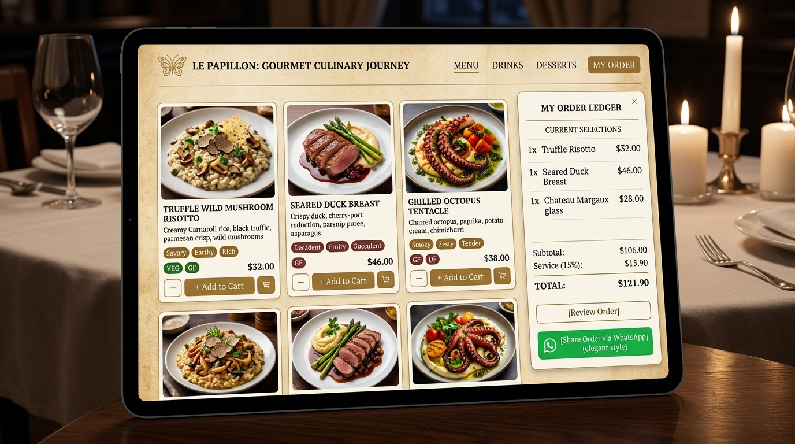

# 🍽️ The Spice Kitchen — Digital QR Restaurant Menu

A luxury, high-performance, mobile-first **Digital QR Restaurant Menu & Table Ordering Web App** built for modern hospitality. Provides guests with touchless dining, rich visual dish galleries, artisanal flavour profiles, interactive table cart selections, and **instant 1-tap WhatsApp order sharing**.

---

## 📸 Visual Showcase & Interface



---

## ✨ Key Features

### 1. 🏷️ Artisanal Flavour Badges
- Every dish is labeled with authentic culinary flavour notes (e.g., `🔥 Smoky & Charred`, `🧈 Velvet Makhani & Kasuri Methi`, `🧄 Burnt Golden Garlic & Spinach`, `👑 Aged Basmati, Kesar & Dum`).
- **Smart Flavour Search**: Diners can search directly by taste cravings like *"garlic"*, *"smoky"*, *"saffron"*, or *"creamy"*.

### 2. 🛒 Direct Add to Cart & Table Selection
- **1-Tap Add on Every Dish Card**: Add dishes directly to the table cart without interrupting browsing.
- **Interactive Mini Steppers**: Easily increase (`+`) or decrease (`-`) portion quantities directly on cards or inside the Dish Detail modal.
- **Special Chef & Kitchen Notes**: Diners can tag individual dishes with instructions (*"Mild Spice"*, *"Extra Butter"*, *"No Alliums"*, *"Crisp"*, *"Lime Wedge"*).

### 3. 💬 WhatsApp Order Sharing
- **1-Tap WhatsApp Share**: Export the current table order directly to WhatsApp with a single tap.
- **Auto-Formatted Bill & Summary**:
  - Restaurant name & Table number (`Table 04`)
  - Itemized dishes with portions and subtotals
  - Dietary badges (`[Veg]` / `[Non-Veg]`) and flavour notes
  - Custom kitchen instructions
  - 5% GST calculation and estimated grand total

### 4. 📱 Dynamic QR Table Code Generator
- Generates downloadable, print-ready QR codes for all restaurant tables (`Table 01` to `Table 12`).
- Auto-detects table numbers via URL query parameter (e.g., `?table=T04`) when diners scan the physical QR sticker on their table.

### 5. 🔍 Instant Search & Multi-Faceted Dietary Filters
- Instant real-time search across dish titles, descriptions, ingredients, and flavour tags.
- One-touch dietary filters: **All**, **Vegetarian (🟢)**, **Non-Vegetarian (🔴)**, **Vegan (🌱)**, and **Gluten-Free (🌾)**.

### 6. 🛎️ Server Readout View & Service Call
- **Captain's Folio (Server View)**: High-contrast, large-typography ledger view optimized for servers reviewing table orders in ambient restaurant lighting.
- **Call Waiter Feature**: Interactive bell notification to request assistance or request table water.

---

## 🚀 How It Works (User Flow)

```
┌────────────────────────┐      ┌────────────────────────┐      ┌────────────────────────┐
│  1. Scan Table QR Code │ ───► │ 2. Browse & Add Dishes │ ───► │  3. Customize & Review │
│  Auto-pairs to Table # │      │    Flavour Badges      │      │    Portions & Notes    │
└────────────────────────┘      └────────────────────────┘      └────────────────────────┘
                                                                             │
                                                                             ▼
┌────────────────────────┐      ┌────────────────────────┐      ┌────────────────────────┐
│  5. Kitchen Prepares   │ ◄─── │ 4b. Share on WhatsApp  │ ◄─── │ 4a. Show Server Folio  │
│     Fresh to Order     │      │   Instant Order Text   │      │  High-Contrast Readout │
└────────────────────────┘      └────────────────────────┘      └────────────────────────┘
```

1. **Table Pairing**: Guest scans the QR code on Table 4 (opens menu with table context `?table=T04`).
2. **Explore Menu**: Diner browses categories (Starters, Curries, Biryani, Breads, Drinks, Desserts) with flavour badges and dietary chips.
3. **Build Selection**: Taps **"+ Add to Cart"** and adjusts portion quantities or adds custom chef notes.
4. **Order Placement**:
   - Tap **"Share on WhatsApp"** to send the itemized order to the restaurant's WhatsApp business number or a group.
   - Or tap **"Order with Server"** to display the high-contrast Captain's Folio for table staff.

---

## 🛠️ Technology Stack

- **Frontend**: Modern Vanilla TypeScript / JavaScript (ES6+), HTML5, Tailwind CSS.
- **Build System**: Vite.
- **Performance**: 100% Client-side static architecture, zero-latency search, lightweight bundle.
- **Styling**: Warm linen parchment dining aesthetic (`#FAF8F5`), obsidian cards (`#1C1917`), and warm brass accents (`#D97706`).

---

## 📦 Local Development

```bash
# 1. Install dependencies
npm install

# 2. Start local development server
npm run dev

# 3. Build for production
npm run build
```

---

## 📄 License
Crafted for modern dining experiences and restaurant hospitality.
